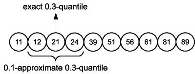
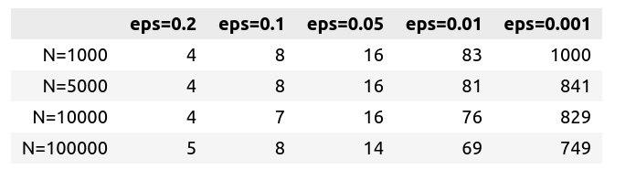
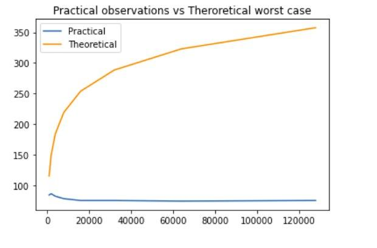

# Statistical Techniques for Data Science [S22]
## Assignment 1. Baykov Ayaz BS18-DS01

### Approximate Quantile Computation on Large-Scale Data

Describing a quantile statistics of a stream of a **large-scale data** often raises a problem of efficient computations in terms of space complexity. Exact approach requires to store every element of a stream in a sorted list, which is impossible for the real world applications. An alternative is to search not exact answer but some value which is close enough.

An approximation error of such methods is denoted by $\epsilon$. This value indicates what offset in rank is applicable when describing quantile. For $\phi$-quantile the interval for the answer would lie in $[\phi N-\epsilon N;\phi N+\epsilon N]$ in that case



M. Greenwald and S. Khanna [1] introduced an algorithm for $\epsilon$-approximate $\phi$-quantile computation that has $\Theta(\frac{1}{\epsilon}log(\epsilon N))$ space complexity in the worst case.

This repositary in an implementation of the algorithm in Python.

### How to use the code

```python
from gk import Sketch

epsilon = 0.001
test_sketch = Sketch(epsilon) #init sketch object

# try on random sequence of numbers
N = 100000
random_vars = np.random.randint(0, 100, N)

for v in random_vars:
    test_sketch.insert(v)
```

To get quantile:
```python
quant = 0.5 #get median
answer = test_sketch.quantile(quant)

print(f'{test_sketch.eps}-Approximate {quant}-quantile is {answer}')
```
To check how many elements is stored is memory:

```
sketch.items_num()
```

All simulations and result may be found in `gk_use.ipynb` file.

### Results
Following dataframe shows number of tuples used in sketch for different cases.


These numbers are much less compared to ones introduced in paper, yet there authors tested algorithm on a specific 'hard input', while these are results for randomly generated data. Paper confirms that practical observations are usually consume much less space.



In the implementation for the Sketch data structure usual Python lists are used and the order is correctly maintained during insert operations. That means the operation of insertion and compression have linear time complexity depending on number of items in a data structure, which approaches to constant for practical cases, so this is not much of a concern.


### References
1. M. Greenwald and S. Khanna, ‘‘Space-efficient online computation of
Quantile summaries,’’ in Proc. ACM SIGMOD Int. Conf. Manage. Data,
Santa Barbara, CA, USA, May 2001, pp. 58–66.

